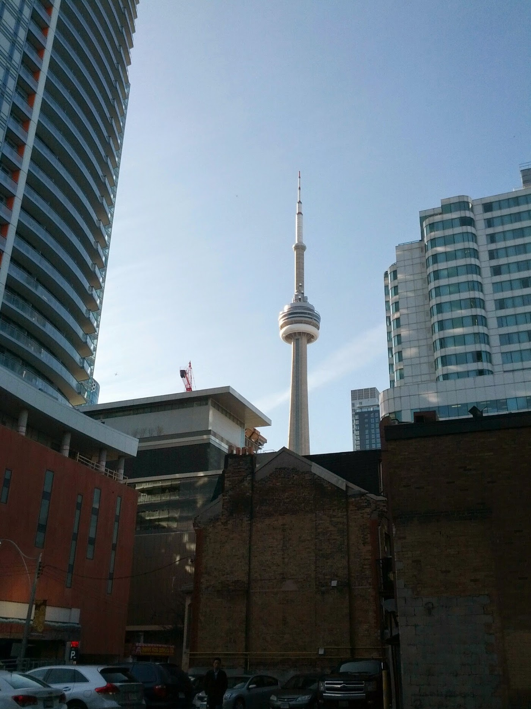
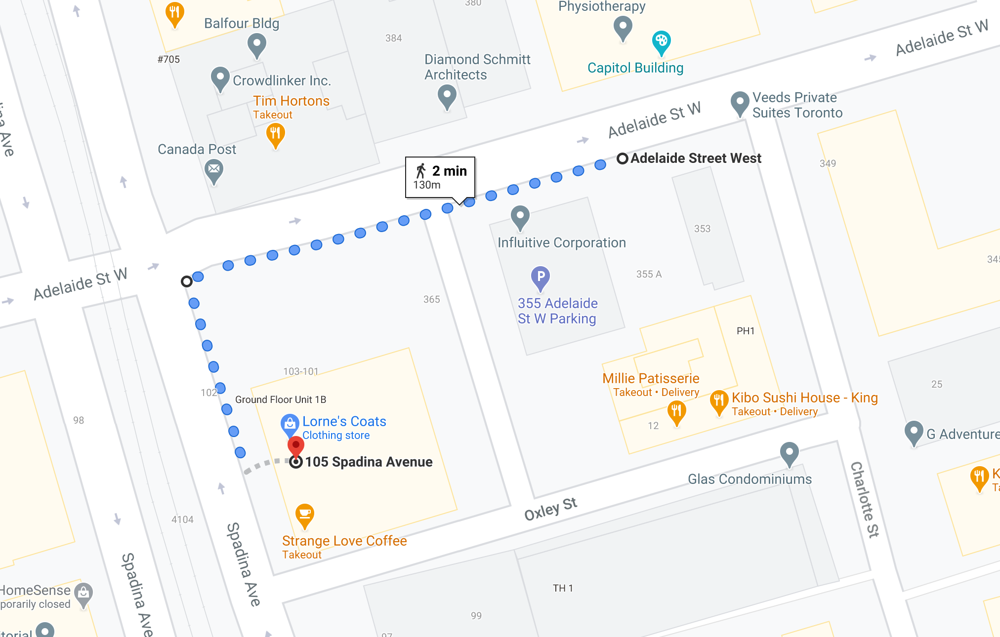

>  In 2018 I wrote [this blog post](https://www.arjunkalburgi.com/writing/6he-6ty-that-ma6e-me/) about how much the city of Toronto means to me. Since that post, I took a 3 month design course and got my first and second full time jobs while living here. This weekend I was able to add another beautiful layer to that story arc.

This is a picture I took on May 5th 2014, my first day of my first tech job, I was 19. I remember taking the GO Train in from Brampton and walking my way to Spadina from Union Station. I was so excited that I reached the office before it even opened. I took this picture after I left the office to walk around the block while I waited for people to show up. This is the approximate route I took from the office to take the picture:

On the way to the photo’s location, I walked past a coat store, Lorne’s Coats. I’m not sure if I walked into the store that day in particular but I remember that when I did walk in once that summer I laughed myself out after seeing the price tags.

In the years after I’d remember the store as a mysterious local Toronto gem every time I walked past and saw it’s billboard on the North face of it’s building. This history I had with the store only hit me when I pulled up to it this Friday, taking the day off work to go buy a coat. 

Walking out of the store with the coat on my shoulders I could feel the meaning in its weight, that six years later I was able to grow and afford a coat that I had once laughed at.

I feel incredibly grateful. I want to say thank you to everyone that has helped me throughout my journey, I’m blessed with your mentorship and guidance and please know that I’m not done growing and going. 

And lastly, a special thanks to the city of Toronto, and the many memories I have with her.