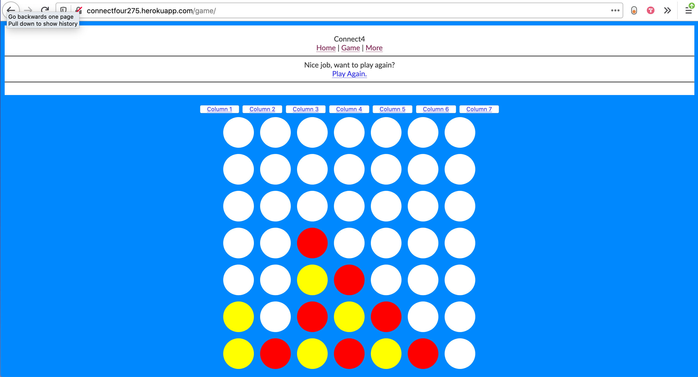
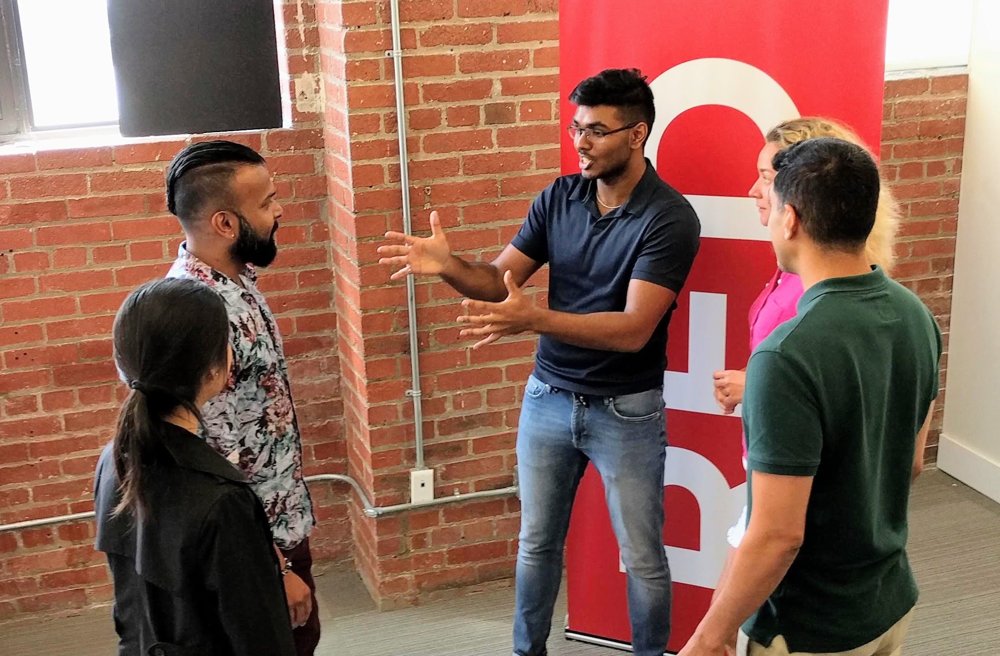
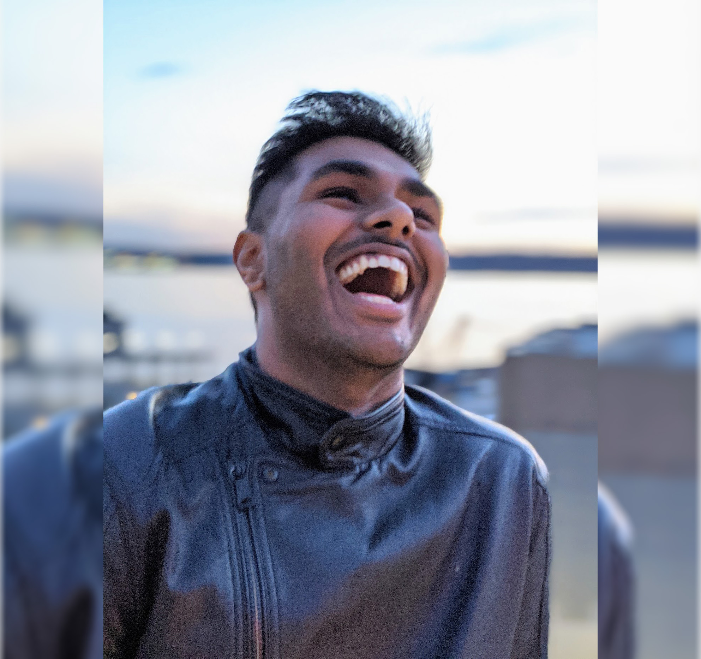

> Over the last 5 years I've been learning strong UX skills to build web interfaces and products that connect and enable people. I want to look back on this journey, thinking about where I've been and some of the specific memories I have.

## The beginning

I remember the first time I ever thought about usability and accessibility. Back in 2014, my second year of Computer Engineering (CompE) my class assignment was to build a python game. Everyone was using pygame for their frontend but to me that didn't make sense - no one could play my game if it just sat on my computer. It needed to be on the Internet, where everone could access it regardless of their device or mobile OS (Android vs iOS was huge at the time).

I complained to the senior year CompE students, and they answered matter-of-factly that we should put it on the Internet then. They taught me Flask and taught me about the Client-Server relationship, how AJAX worked, and even how to host the site. (It's still live today at [connectfour275.herokuapp.com](connectfour275.herokuapp.com).) 

But damn that site was/is ugly, 😂 it prompted me to start studying UX in my free time (starting with Don Norman’s Design of Everyday Things) and I became that designer CompE, advocating for it in other [group projects](https://github.com/arjunkalburgi/CloudyCar). 

This was the beginning of my dream to amass as many of the skills I could in order to build wholesome, user-centered products. 

## Loving impact

I had joined the CompE Club so that I could learn from the senior year students, but as I became a senior year student myself, I took on more of a leadership role. 

For 3 years I was the team-lead for organizing Alberta’s largest hackathons and became the superconnector between the student, academic and local startup communities. I felt like I was on top of the world. 

As we kept making the largest hackathon larger, I got called on for speaking engagements, faculty recruting events, cross-faculty expeditions to Iceland, and more.

One story I always love is how my friend Liza, an EE, got mad at a couple of us CompE's for delaying her birthday dinner so we could code our side-projects. Then we started organizing the hackathon, and more of her friends started participating, and she got to see how much cool things we could do with code. Two years later she was coding on her birthday - cleaning up her first hackathon project which won her 3rd place! She's now in her Masters for CompE.

We created such a [big impact](https://www.arjunkalburgi.com/writing/growth-hack-ed/) on student's lives and I love it.

## Learning UI 

As I was studying CompE, learning UX, and organizing hackathons, I soon learned that visual design is a key component to creating the exceptional user experience I was after. So upon completing my degree, I enrolled in RED Academy's UI course - not to become a designer, but to learn the craft and speak the language. 

The course was a lot of fun with design challenges and client projects. I also got to work with the UX students and learn a bit of their process and methods. For one project, my shy UX groupmates had me conduct their UX interviews because I was a lot better at it 😂 teaching myself throughout university really paid off for that project.

The best thing about the course was that I learned to [respect my own creativity](https://www.arjunkalburgi.com/writing/thinking-about-being-creative/). We all have the ability to be creative off the dome and by practice and honing it we can turn that creativity into something beautiful and to be proud of. It is an awesome feeling.

## Creating Products 

With visual design under my belt, my side projects became the type of wholesome products that I craved to make. They put together UX, UI and code to create great interfaces that would try to make a difference. 

##### Slackify

An app for improving team culture by making uploading custom Slack emojis easy and simple. [More here.](https://www.arjunkalburgi.com/writing/redesigning-slackify-an-easy-custom-emoji-solution-for-slack/)

##### Stressful Tasks

An app for reducing stress by visualizing tasks as part of a whole. [More here.](https://www.arjunkalburgi.com/writing/stressful-tasks-a-behavioural-design-experiment/)

##### TheRadList 

An app for improving team culture by making uploading custom Slack emojis easy and simple. [More here.](https://github.com/theradlist/theradlist.github.io)

I started calling myself "full front", as opposed to "full stack" because I can handle the full frontend of a product 😂

## Putting it together 

A year ago I was presented with the opportunity to be the only technical member of a startup, building a mobile banking app with strong UX that the founder could then pitch to clients and investors. Basically doing what I was doing in my side-products, but now professionally.

I took the opportunity as a chance to be an entrepreneur, wearing as many hats as possible as I built out the company’s product, the marketing site, and much more. The job allowed me to focus on building production-quality user interactions, such as [swipe-to-confirm](https://www.arjunkalburgi.com/writing/creating-a-swipe-to-confirm-component/) and [custom number input](https://www.arjunkalburgi.com/writing/custom-input-behaviour-for-numbers/), while also teaching me new skills such as project and relationship management.

There were a lot of rough patches and things I could've done a lot better, but the learning experience was incredible. And most of all I acheived my 5 year running goal of being able to build usable and useful products! 

## From here...

There's still a lot of learning for me to do. I want to become a better accessibility developer and advocate, I want to improve my web animations and build my confidence in React. 

But overall this life story update ends with a big smile. Professionally speaking, I'm very proud of myself. 😃❤️

------

Follow me on [Twitter](twitter.com/arjunkalbugi) to hear more from me, more often. There I talk about design stuff, code stuff and random stuff. 
