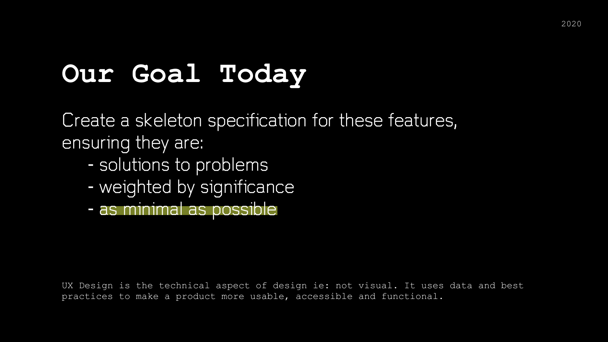
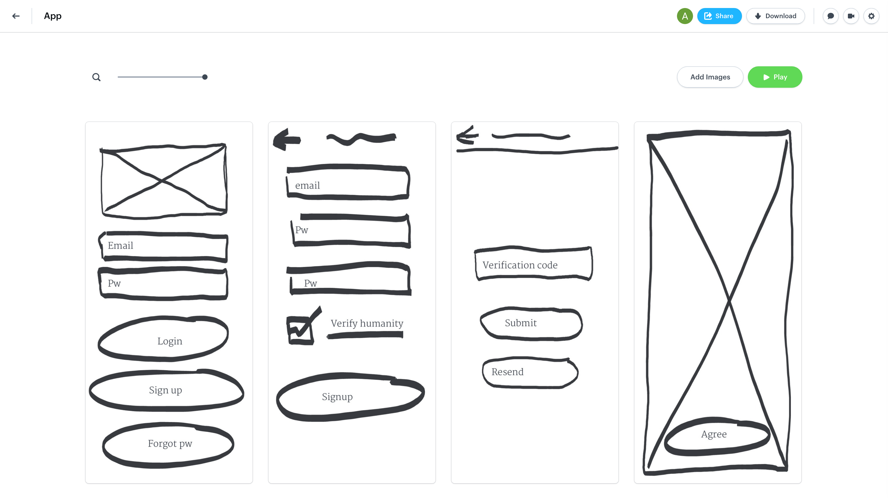

> I recently started a new project, giving me the chance to build some Product Management skills. I've known about Basecamp's Shaping Up process for a while now and finally can try it out for myself. I've mostly stuck to the book on this one, but had to change some things.

Last year (summer 2019) BaseCamp released a new book, Shape Up, describing their new project and product management style (aka agile replacement) for developing software. It includes how they breakdown work and perspectives on timed deadlines, but to me the most interesting part is how they "shape" features.

On this new project, I've been asked to do some PM and have used this shaping on the core features to ensure that each feature is:

1. a solution to a problem
2. weighted by significance 
3. as minimal as possible

I highly recommend skimming the free and online book [here](https://basecamp.com/shapeup/webbook). 

## Using an ensemble cast

Since I've come onto the project as a consultant, I don't actually know much about the product I need to build a spec for. The book assumes that the person doing the shaping is intimately familiar with the project. 

To counter this, I've taken what I think of as the "JFK approach". During JFK's presidential term he learned that his generals and advisors wouldn't speak their mind properly in front of others. He needed to connect with each individually to understand their perspectives and make the best decisions (eventually helping him get through the Cuban Missile Crisis). I've done the same with different people in the company.

After shaping the initial spec to the best of my knowledge, I began having open conversations with key stakeholders in the company. The marketing team has as unique a perspective as the technical team, the CEO and COO have different ideas for how things need to fit together. I made it my job to understand all these and then use conversation to compile them together. 

## Breaking scope into releases

Basecamp's Shape Up has two methods for trying to reduce a feature, Out of Bounds and Cut Backs. I found these are a little hard to grasp/useless when doing this iteratively. So instead, I broke out a roadmap of First Launch, Wider Launch, and Further Features and I diligently asked and reasked where features need to be placed.

I found this is really good model to set up to help fight scope creep by having a 2 month timeline between First and Wider, thus it's not such a big loss when someone's features don't make it into First. It's only a 2 month wait. 

The team really loved this approach too, finding it organized and easy to understand. 

## Understanding flow

After a few iterations of shaping, the app spec began to visualize in my mind. I began to get a grip on how the user would go through the app. The book doesn't cover how to Shape Up a new project, so this realization was unexpected.

But I don't think this was visualizing for everyone else, so I used Marvel App to build a quick prototype using my fat marker sketches. This was timed with needing to update my sketches, so I just redid everything in Marvel. (Marvel you need to update your pen tool please). The Marvel sketches needed a little more detail than the fat marker sketches so that people could understand what they were looking at. I accomplished this with simple text fields to keep the conversation in an idea phase. 

The team really loved having something in their hand and brought up a bunch of new features that we could do. This helped me talk about scope creep and get everyone to understand and then decide on boundaries for launch and thereafter. It also brought up a lot of design questions that weren't answered yet, which I needed to keep shooting down.

## Other thoughts and comments

### Not designing

Many times throughout the process (especially when using Marvel App) I've had the itch to move away from specifying the app to designing the app. For example, how will achieving Functionality A affect the user flow of Use Case 1? It's not actually my job to figure out how the pieces will fit together, just which pieces are necessary and aren't. I actually had to remove screens from the Marvel App because I got ahead of myself and it confused my team.

### Scope Creep

Coming from a technical background, I'm very weary of scope creep and sometimes it was difficult to swallow when decisions were made to increase the scope. But actually, it's not really scope creep if those features are necessary for the app. I had to take the approach that I just helped the team find that hole.

### Working in Parallel

One of the cooler parts of this method is it doesn't slow down development. Since the rough understanding of the app is already understood throughout this spec, the dev team can begin constructing the architecture of the app. The designers can also go in and start designing broad strokes, conducting research and deciding layout. When the spec is complete, the designers can start to refine the details of the flows and UI.
