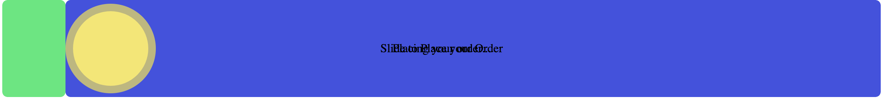

> The Amazon app features a Slide-to-Confirm element inspired by Apple's "Swipe to Unlock". Surprisingly, a similar component is nowhere on the internet, so I'll need to create it myself.


Designers can use Slide-to-Confirm as a tool to help their users feel more secure (than a button that can be accidentally tapped) and more accomplished (takes more work to slide across the screen). Amazon uses it in their "Buy Now" flow to prevent accidental purchases. 


The UX of this component is great! Showing green and changing the message as you swipe brings out the security and accomplishment feelings. Unfortunately, it's also highly custom.


### Looking for similar's online

The only similar Javascript-based components I could find online were this [codepen](https://codepen.io/bennettfeely/pen/jyGeJ), this [blog](https://www.davidbcalhoun.com/2011/implementing-iphones-slider-unlock-with-input-typerange/), and this [React Native library](https://github.com/agentS/react-native-slider-button); none of which really come close to the functionality I'm looking for. Android and iOS devs had something closer but I'm looking for a Javascript and CSS solution. They all use the `<input type='range'` element, so let's start with that.


### Browser support for Thumb Range

Using the blog to help kickstart my progress, I made a codepen and quickly figured out some interesting things. The blog only supports Firefox when applying CSS to the `<input type='range'` element using `input::-moz-range-thumb`. I needed to include `input::-webkit-slider-thumb` for support on Safari and Chrome, the platforms I'm developing for.

Also strange is that Chrome required a `margin-bottom: -7px` in order to center the slider vertically.

Progress on the component here: 
https://codepen.io/arjunkalburgi/pen/dyyJMKO


### A new idea

Turning my attention to how I'll solve changing the track message and colour as you swipe got me looking at something new: draggable components. 

What if I was able to use some drag-and-drop JavaScript to make my slider?

Staring with [this drag tutorial from Kirupa](https://www.kirupa.com/html5/drag.htm), I first modified it to only drag horizontally and then to not drag over the container width.

Progress here:
https://codepen.io/arjunkalburgi/pen/GRRyjzZ


### Is the new idea feasable?

If the new idea could actually work, then I'll be able to put elements on both sides of the slide item that will show and hide as I move the slide item. 

I was able to create this functionality with blue and green bars. The most difficult part about this was honestly figuring out the logic of the HTML elements. I decided that having two tracks on top of each other with `position: absolute` and a high `z-index` for the item worked best: 

```html
<div id="outerContainer">
  <div id="container">
    <div id="item"></div>
  </div>
  <div id="container">
    <div id="green"></div>
    <div id="blue"></div>
  </div>
</div>
```

The bars move by changing their width in JS along with the drag of the item.

Progress here: 
https://codepen.io/arjunkalburgi/pen/rNNpWdX


### Text in the Bars

Now to have text within the bars so that sliding reveals/conseals the text. I quickly made an inner div with the text and made it fit to the grandparent: 

```css
#bar_inner {
  // center the text
  height: 100%;
  display: flex;
  justify-content: center;
  align-items: center;
  
  // position bar
  width: 100%;
  position: absolute;
  top: 0;
  left: 0;
}
```

However this made both text's appear on top of each other. 



And adding  `overflow: hidden` to the parent bar's does nothing (because the parent is not absolute as well). I'm actually really stuck here... 🤔

In the end I went with not the most elegant solution, but I think with a CSS transition it can be okay. I used JS to switch the `z-index` of the bars, so that the text essentially switches places and is covered by the other bar. 

See it here: 
https://codepen.io/arjunkalburgi/pen/poopRzX


### Confirm alert, and fallback

Now that I have my meat set up, I need to add the potatoes. I need to trigger an event once the slider reaches the end and if the slider doesn't reach the end, it should fallback to the beginning. 

Both potatoes were pretty easy, just needed to have some logic in the `dragEnd` function

```javascript
// in dragEnd(e)
if (currentX < dragWidth) {
  setTranslate(0, dragItem);
} else {
  alert("Confirmed!");
}
```

I've added an animation on fallback and wrapped the alert in a function for the CodePen:
https://codepen.io/arjunkalburgi/pen/BaaJYbx


### Finalizing

To finish it off, I cleaned up my code using BEM CSS, and removed some of the unnecessary things like the coloured bars(*) and styled the dragItem. 

> (*) Since the `overflow: hidden` didn't work, it's better to go with an opacity change for the text and changing the background colour of the bar instead of keeping two different ones. 

https://codepen.io/arjunkalburgi/pen/QWWamxW


### Converting to Angular

Now that I have the component in JS, I need it in Angular. This was simple enough overall, but had an annoying time making it work due to some scope bugs. After taking the weekend off and then running the code locally, I was able to figure them all out and have it all working. 

I put the final version in CodePen here: 
https://codepen.io/arjunkalburgi/pen/xxxpzPx


I'd like to go a step further and create a github repo and NPM library for this component, but maybe that'll be for another day! 


Thanks for reading! 


