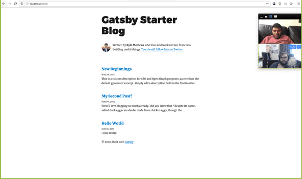
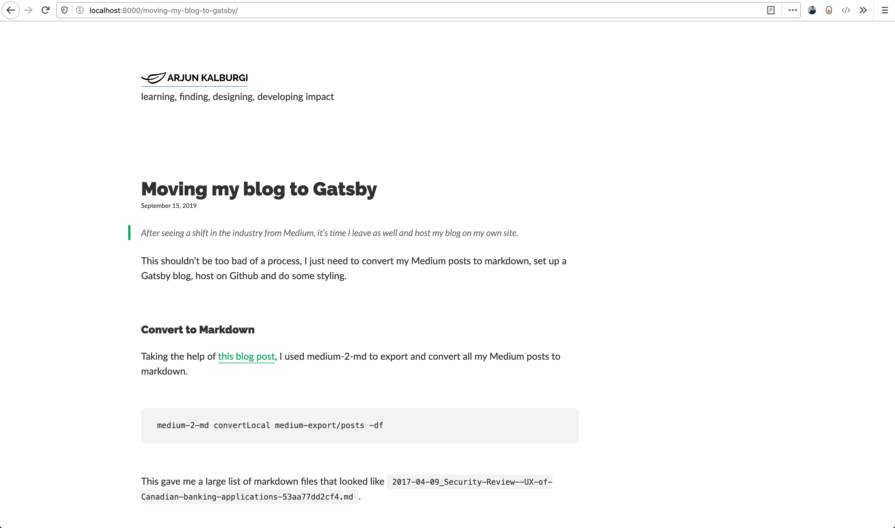

> After seeing a shift in the industry from Medium, it's time I leave as well and host my blog on my own site.


This shouldn't be too bad of a process, I just need to convert my Medium posts to markdown, set up a Gatsby blog, host on Github and do some styling.


### Convert to Markdown

Taking the help of [this blog post](https://www.gautamdhameja.com/medium-to-markdown-converter/), I used medium-2-md to export and convert all my Medium posts to markdown. 

```bash
medium-2-md convertLocal medium-export/posts -df
```

This gave me a large list of markdown files that looked like `2017-04-09_Security-Review--UX-of-Canadian-banking-applications-53aa77dd2cf4.md`. 


### Set Up Gatsby Blog

Gatsby's got a [blog-starter](https://github.com/gatsbyjs/gatsby-starter-blog) repo, which was quick to clone and get up and running.




Then using some bash scripts to format my markdown posts to the file structure Gatsby expects. 

```bash

# make the new directory
$ for f in *.md ; do mkdir -p ../blog/$f ; cp $f ../blog/$f/index.md ; done 

# remove the date from the beginning of the directory name
$ for d in *.md ; do mv $d ${d#*_} ; done 

# remove the '.md' from the end of the directory name
$ for d in *.md ; do mv $d ${d%-*.md} ; done 

# lower case all characters`
$ for d in * ; do mv $d ${d,,} ; done 
```

Going from `2017-04-09_Security-Review--UX-of-Canadian-banking-applications-53aa77dd2cf4.md`, to `security-review--ux-of-canadian-banking-applications`. 

This helps because now the url for my posts will look like: `www.arjunkalburgi.com/writing/security-review--ux-of-canadian-banking-applications`


Now my blog is ready to go 😃. Thank you to my bff [Andrew Fontaine](https://twitter.com/afontaine_ca) for helping me out with this part.


### Host on Github Pages

Thanks to Gatsby's [gh-pages hosting tutorial](https://www.gatsbyjs.org/docs/how-gatsby-works-with-github-pages/) I was able to get this done pretty easily. Just needed to make a repo in github, set the `origin` in my local repo, follow the tutorial and then run `npm run deploy` . And I'm up!

Without CI, every time I push to Github I'll need to run this command. This is okay for now but I'll probably look to change this later. 


### Styling

Honestly I could spend all day doing this, but for now I just want something quick. I'll use a lot of the CSS I already have from my [website](www.arjunkalburgi.com). But for the blog posts, for now I'll just copy what Varun's got on [his site](varun.ca/writing), it's gorgeous.

Despite the simplicity of this task, it was actually quite time consuming to style the blog. Based on my commit history, it was the markdown posts that took forever to style. For some reason, Gatsby does not have this built into their default style for their starter package I used, making me wish I knew to use a theme'd starter from the beginning (there's no way to change your theme afterwards.) 




### Results

Pretty happy with the public facing results, but on the internal there's a couple things I lose. 

One is that I don't have the nice editor Medium provides. I installed [Typora](https://typora.io/) to fix this (using it right now). It lets me paste images into the markdown files and helps me out with presenting my images as well. 