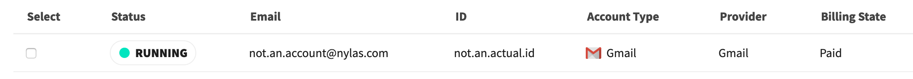
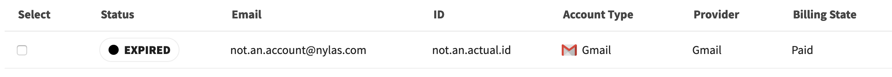
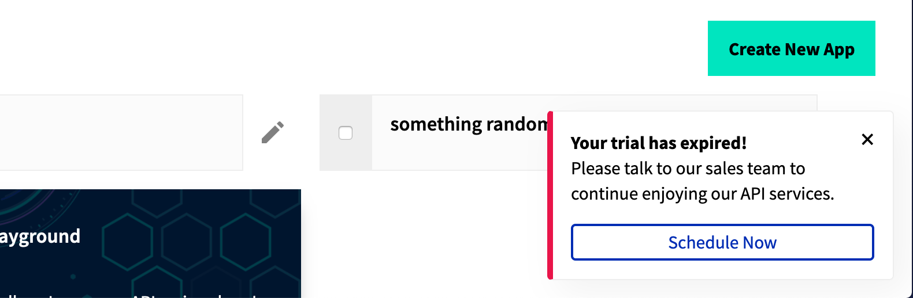
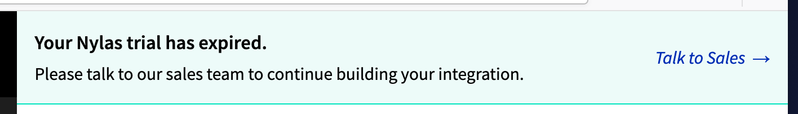
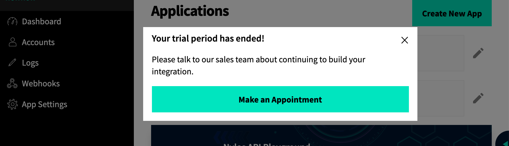

> Last week I launched a new experience for Nylas users who've had their trial expire. This blog outlines those changes and how I went about making them.

## Intro 

Hello hello! It's now been four months since I joined the frontend team at Nylas, Team Wonka 🎩, time flies! In that time we re-built and launched the new [Nylas Dashboard](https://dashboard.nylas.com) and are now expanding on it's functionality by improving edge-case experiences. 

Last week we launched a renewed *Trial Expired Experience*. A feature that has always been sorely missing from the dashboard, and a feature that I personally took a lot of ownership of. The *Trial Expired Experience* will be an integral part of converting Trial users by nudging them towards contacting sales or (coming soon) subscription options. 

As part of my ownership of this feature, I took the lead on Investigation, Specification and Implementation.

## Investigation (aka Research)

Once this project came onto our radar, the first step was to investigate the current trial expiry experience in the backend to understand what the specification for the frontend needs to be, wheather that is to mimic it or to make up for it.

By speaking with longer-tenured Nylas employees including those in Sales and Engineering, I learned that Trial users that passed their `trial_end_date` cannot Auth new Accounts, have their exisiting Accounts stop Syncing, and get their Logs washed after the update cycle. I took the opportunity to test these limitations in the dashboard, and found that users acctually can Auth new Accounts, but they stop syncing within 24 hours. In doing this, I realized that Webhooks should also be limited.

## Spec (aka Recommendation)

Testing the limitations in the dashboard gave me a good sense of what was lacking about the Trial Expired Experience. Knowing what was stopped from the backend, it was clear the type of messaging needed on the frontend to make for a better experience. I'd want the UI to be transparent about what functionality was stopped, and what actions I could no longer perform. 

Starting with the transparency, it needed to be shown that Accounts were no longer syncing. This could easily be done because the Accounts table has a Status column. Additionally, I noted that though Webhooks were not stopped, they  have a similar Status column and it could easily be communicated in the same way. 



Moving to the actions, my spec outlined blocking users from the Create New App, Auth Account and Create New Webhook flows. This way users wouldn't have to experience any error messages and would be told the functionality is unavailable before they spend time filling out the forms.

Doing a final sweep of the Dashboard, imagining how else Trial Expiry could be communicated, I felt that the other pages should also have some messaging, perhaps via a persistent reminder at the top of every page. For additional attention, I also recommended a modal that pops up on entry into the dashboard that tells you your trial is expired.

## Implementation

After conversation and approval by the Product Manager, I set to work on implementing them.

The first step was deducing the logic for noting when the user is in the Trial Expired state. It ended up being a little messy line of Boolean logic. It checks if the Organization does not have billing enabled and if we are past the Organization's `trial_end_date`.

```javascript
!$organization.billing_enabled && new Date() > new Date($organization.trial_end_date * 1000);
```

Next was to update the Account's and Webhook's Status. In another feature, I learned that accounts have a `detailed_account_sync_state` parameter. I brought it up with the greater engineering team if we could add a new value for this parameter to show an "expired" status. Despite positive feedback, this feature did not fit the current timeline of the other engineering teams and we agreed that we can overwrite the status in the frontend only to acheive this effect. 

```javascript
if (isTrialExpired) {
  accounts.map((account) => {
    account.mail_sync_state = "expired";
    account.detailed_account_sync_state = "expired";
  });
}
```



To block the actions, I replaced the functionality of the buttons to fire a notification alerting the user about their expired trial.



The persistent messaging throughout the app went through a few design iterations before ending up as a nice little top banner: 



And the modal was simple enough with our existing modal component: 



## Conclusion

In the week since Trial Expired Experience was launched, the team has made large strides towards launching Self Subscription (where Trial Expired Experience can really shine).

Check it out yourself on the [Nylas Dashboard](https://dashboard.nylas.com)! 

Nylas is a great place to work! If you're interested in any of the [job postings listed](https://jobs.lever.co/nylas/), please let me know and I can refer you!

